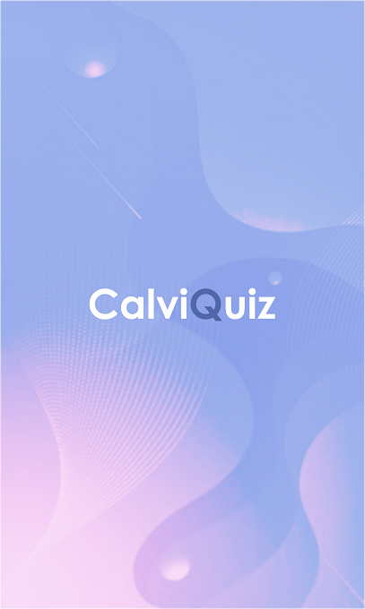

# CalviQuiz
App to check your baldness level through a quiz.

## Tools

- Node
- React native
- Expo




## Setup

You will need [Node](https://nodejs.org/en/) and [Expo](https://expo.io/) installed.

Install all dependencies:
```
npm install
```
Finally, run :
```
expo start
```
